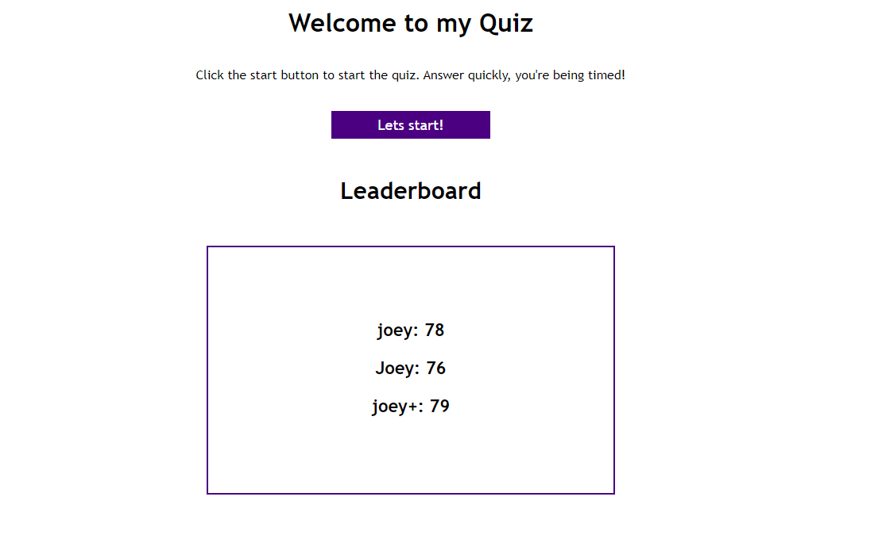
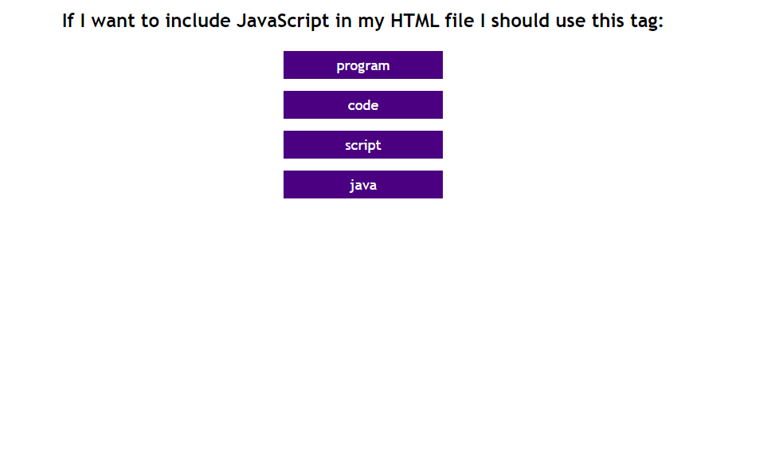

# My Code Quiz

## Table of Contents
The following readme contains these sections:

* [Screenshot](#Screenshot)
* [Usage](#Usage)
* [Live-Link](#Live-Link)
* [License](#License)

## Screenshot

## Usage

[My Code Quiz](https://joey-sisk.github.io/CodeQuiz/) was designed using only vanilla JavaScript, HTML, and CSS. The quiz features a timer that decreases and turns red if the user chooses a wrong answer. If the user answers every question or runs out of time they will br prompted to enter their name which will saved along with their final score to the local memory. When the home page loads up again the page will fill out the leaderboard with the top scores and their scores. 

This would not have been possible without the help of my tutor Kumar Ramanathan, my instructor Calvin Carter, all of the class TA's, and many of my fellow UT Bootcamp students.

## Live-Link

[You can find a link to the live site here.](https://joey-sisk.github.io/CodeQuiz/)

## License

There is not currently a license for this service as it is only a homework assignment for the UT Coding Bootcamp Class 2020-2021
